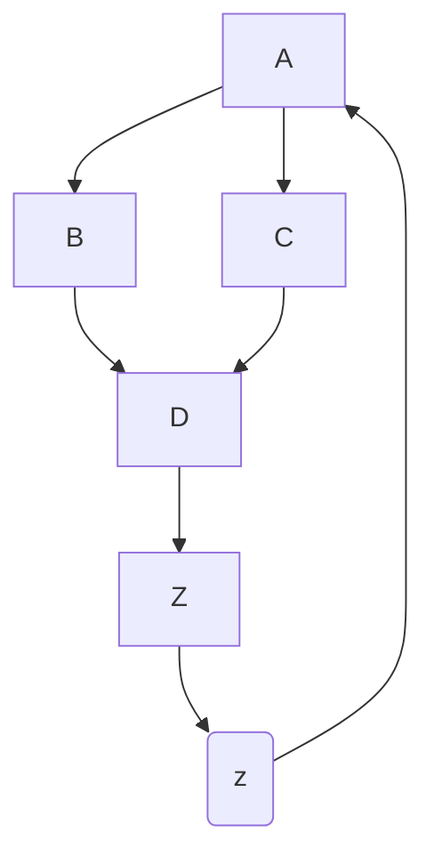
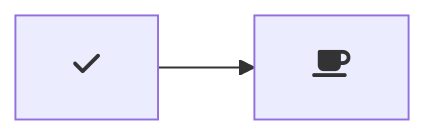
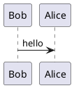

# how to use guide for markdown files


<ol>
    
<li> 

## Headings

# Heading 1

## Heading 2

### Heading 3


<li> 

## text styling

**Bold Text**

*Italic Text*

~~Strikethrough~~

`Inline Code`


<li> 

## lists

- Unordered Item 1
- Unordered Item 2
  - Nested Item
1. Ordered Item 1
2. Ordered Item 2


<li>

## links
[Abhijith K S](https://www.linkedin.com/in/abhijith-k-s-aks3743/)


<li>

## images


<li>

## block quotes

> This is a blockquote.


<li>

## code blocks

```python
def hello_world():
    print("Hello, world!")
```

<li>

## tables

| Header 1 | Header 2 |
|----------|----------|
| Cell 1   | Cell 2   |


| Left-aligned | Center-aligned | Right-aligned |
| :---         |     :---:      |          ---: |
| Content      |    Content     |       Content |


<li>

## horizontal rule

---

<li>

## task lists

- [x] Task 1
- [ ] Task 2


<li>

## task with details

- [x] Task 1
  - Details about Task 1
- [ ] Task 2
  - Details about Task 2

- [x] @mentions, #refs, [links] are allowed.
- [ ] this is an incomplete task.
- [x] This task is complete.


<li>

## footnotes

Some text.[^1]

[^1]: Footnote content.


some other text.[^2]

[^2]: footnote 2


<li>

## defenition lists

Term 1
: Definition 1

Term 2
: Definition 2


<li>

## abbreviations

This is an abbreviation: HTML stands for HyperText Markup Language.

*[HTML]: HyperText Markup Language


<li>

## inline HTML content

<div style="background-color: #f1f1f1;">This is a div element.</div>


<li>

## emojis

:smile: :rocket:


<li>

## superscipt and subscript

H<sub>2</sub>O is water. X<sup>2</sup> + Y<sup>2</sup> = Z<sup>2</sup>


<li>

## adding IDs for Headings (useful for linking within the document):


### My Heading {#custom-id}

[Link to Heading](#custom-id)


<li>

## quote attribution

> To be or not to be...
> - William Shakespeare

<li>

## math equations

$$
f(x) = x^2
$$


<li>


## table of contents

- [Section 1](#section-1)
- [Section 2](#section-2)


<li>

## automatic table of contents

[TOC]

<li>

## admonitions (callout boxes)

!!! warning "Warning"
    This is a warning.


<li>

## mermaid diagrams







<li>

## PlantUML diagrams




<li>

## admonition icons


:::info
This is an information message.
:::


<li>

## presentation slides

--- slide
## Slide Title

Slide content here.
--- slide
## Another Slide

More content.
---


<li>

## embedding youtube vidios

<iframe width="560" height="315" src="https://youtu.be/URc_PwZpYIc" frameborder="0" allowfullscreen></iframe>


